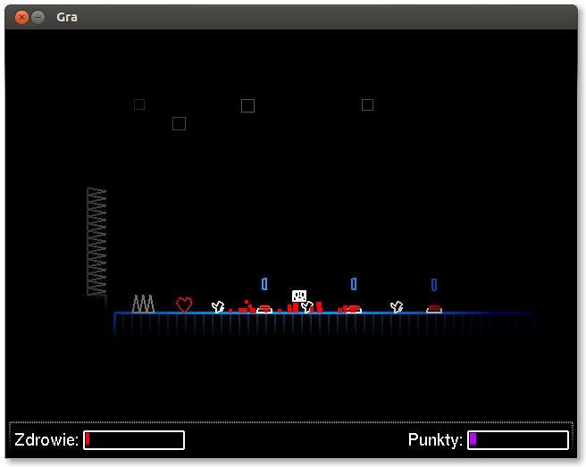

Rect-Adventures
===============

Jest to gra platformowo-zręcznościowa, której głównym założeniem jest renderowanie całej grafiki przy pomocy tylko i wyłącznie wektorów. Celem tej gry jest 'uzbieranie' określonej ilości śmieci z planszy przez robota pamiętając o omijaniu przeszkód.

Technologie jakie użyłem:
- System operacyjny: Ubuntu 13.04 64 bit
- Eclipse Kepler z pluginami CDT i Javy
- g++ wersja 4.7.3
- valgrind 
- github

Biblioteki jakie zastosowałem:
- OpenGL 1.1 - shadery zbyt zmniejszały prędkość na GPU Intel GMA945(ver. OpenGL to 1.5), optymalizacje gry poprzez użycie list renderowania(glCallList) oraz transformacji kamer.
- SDL - odbieranie eventów i tworzenie okna, zbyt mizerna prędkość renderowania
- glut - dla funkcji glutBitmapCharacter()
- GLEW

Języki programowania to: C++0x oraz Java, zaimplementowane technologie:
- składnia c++0x: wykorzystanie auto, domyślnych parametrów szablonów, initializer_list
- AllocKiller - implementacja shared_ptr z biblioteki boost
- Parallax Scrolling - poprzez użycie niezależnych kamer dla każdej warstwy
- VFS(Virtual FileSystem) - wczytywanie/usuwanie/modyfikowanie plików(struktura: [ nagłówek ] [ dane ]  [ pointery ])
- wrapper na funkcje OpenGL umożliwiający wyświetlanie prymitywów
- QuadTree na potrzeby silnika Fizycznego
- Menedżer zasobów automatycznie usuwający obiekty po ich zniszczeniu.
- Snapshot Manager - tworzący migawkę całej gry
- Prosty język skryptowy umożliwiający interakcje z platformami

Wymagania:
RAM: 32mb / Procesor: min.1GHZ / GPU, nie testowane jednak brak użycia VBO zmniejsza ilosć wymaganej pamięci karty.

Uruchomienie:
chmod +x ./Rect\ Adventures && ./Rect\ Adventures

Licencja: GNU GPL

W razie błędów i niedoróbek pisać na email: cziken58@gmail.com
